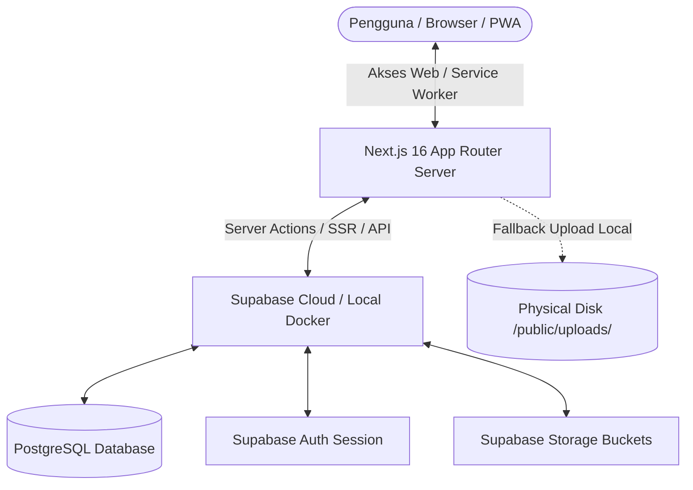
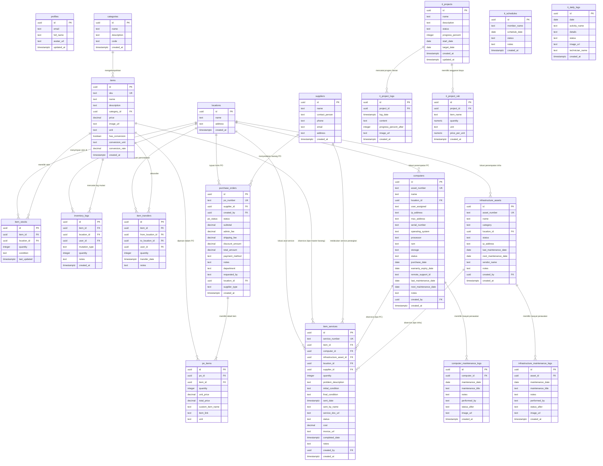

# 🏢 Dokumentasi Teknis & Panduan Penggunaan
## **OpsFlow IT** — *Modern IT Service & Operations Management Suite*
**PT. INVENTARIS TEKNOLOGI UTAMA**

---

## 📑 Daftar Isi
1. [Ringkasan Eksekutif](#-1-ringkasan-eksekutif)
2. [Arsitektur Sistem](#-2-arsitektur-sistem)
3. [Struktur Direktori Proyek](#-3-struktur-direktori-proyek)
4. [Skema Basis Data & ERD (Entity Relationship Diagram)](#-4-skema-basis-data--erd-entity-relationship-diagram)
5. [Keamanan & Kebijakan RLS (Row Level Security)](#-5-keamanan--kebijakan-rls-row-level-security)
6. [Panduan Penggunaan Lengkap (User Guide)](#-6-panduan-penggunaan-lengkap-user-guide)
7. [Panduan Instalasi & Deployment](#-7-panduan-instalasi--deployment)

---

## 🎯 1. Ringkasan Eksekutif
**OpsFlow IT** (sebelumnya *IT Inventory System*) adalah platform manajemen aset fisik IT, sarana fasilitas infrastruktur jaringan, penjadwalan tim, serta siklus pengadaan (Purchasing Order) dan perbaikan perangkat berbasis web. 

Sistem ini didesain khusus untuk berjalan cepat di lingkungan *serverless* (seperti Vercel) maupun di server lokal mandiri (*on-premise*) menggunakan Docker, dengan antarmuka dinamis modern yang mendukung pemasangan Progressive Web App (PWA) di perangkat seluler (Android/iOS) dan desktop.

---

## 💻 2. Arsitektur Sistem

Aplikasi dibangun menggunakan kombinasi teknologi modern demi performa, keamanan, dan fleksibilitas optimal:



### **A. Frontend (Client Interface)**
*   **Next.js 16 (App Router)** & **React 19**: Menggunakan fitur terbaru seperti Server Components untuk render data cepat di sisi peladen, Client Components untuk komponen interaktif, dan Server Actions untuk mutasi data aman tanpa pembuatan endpoint REST API manual.
*   **TailwindCSS v4 & Vanilla CSS**: Penggunaan CSS variabel dan framework modular untuk visualisasi bertema gelap/terang modern (Dark Mode/Light Mode).
*   **Progressive Web App (PWA)**:
    *   **Service Worker (`/public/sw.js`)**: Menerapkan strategi *Network-First* untuk navigasi halaman dengan fallback cache luring, *Cache-First* untuk asset statis peramban, serta *Stale-While-Revalidate* untuk gambar/ikon.
    *   **PWA Register & Install Banner (`pwa-register.tsx`)**: Menyediakan deteksi instan bagi perangkat Android, Windows, macOS, dan panduan pemasangan visual khusus untuk pengguna iOS (Safari).

### **B. Backend & Database (BaaS)**
*   **Supabase (PostgreSQL)**: Sebagai mesin data relasional utama, yang mengelola relasi tabel, tipe data ENUM kustom, constraint unik, serta view data gabungan.
*   **Supabase SSR Authentication**: Validasi sesi pengguna secara langsung di sisi server menggunakan *cookies* asinkron untuk melindungi halaman-halaman internal `/src/app/(app)`.
*   **Supabase Storage**: Digunakan untuk menyimpan dokumen fisik dan gambar saat sistem beroperasi dalam mode Cloud.

### **C. Strategi Penyimpanan File Hybrid**
Untuk menghemat biaya penyimpanan serverless dan mendukung fleksibilitas instalasi, platform menggunakan alur deteksi lingkungan unggahan otomatis (*Hybrid Upload Handler*):
1.  **Mode Serverless (Vercel)**: Karena diska serverless bersifat *Read-Only* (tidak bisa menyimpan file fisik secara permanen), sistem secara otomatis mengonversi file yang diunggah (gambar perbaikan, faktur belanja, bukti dokumentasi) menjadi string **Base64 Data URL** dan menyimpannya langsung ke dalam kolom teks basis data Supabase.
2.  **Mode Server Lokal (Docker / PM2)**: Sistem akan menulis file biner fisik secara langsung ke dalam folder `public/uploads/` pada server. File-file tersebut kemudian disajikan secara aman ke browser melalui *Dynamic Route API Handler* (`/app/uploads/[...path]/route.ts`) untuk mencegah celah keamanan pembacaan direktori (*Directory Traversal Attack*).

---

## 📁 3. Struktur Direktori Proyek

Berikut adalah peta struktur utama proyek untuk memudahkan navigasi kode program:

```
├── .env.local                  # Konfigurasi variabel lingkungan lokal (Supabase URL, Keys, dll.)
├── Dockerfile                  # Konfigurasi kompilasi Docker image untuk deployment mandiri
├── docker-compose.yml          # Konfigurasi kontainerisasi multi-layanan (Next.js + storage volume)
├── next.config.ts              # Konfigurasi runtime Next.js (file size limit, allowed domains)
├── package.json                # Daftar dependensi modul & perintah script npm
├── public/                     # Aset statis aplikasi
│   ├── sw.js                   # Service Worker PWA (Caching & offline strategies)
│   ├── icon-*.png              # File ikon PWA berbagai ukuran untuk perangkat Android/iOS
│   └── uploads/                # Direktori penyimpanan file lokal (di-ignore dari Git)
├── scripts/                    # Script pembantu (utilities)
│   ├── generate-pwa-icons.mjs  # Generator otomatis ikon PWA menggunakan engine Sharp
│   └── add-print.js            # Script utilitas manipulasi berkas cetak
├── src/
│   ├── app/                    # Folder routing Next.js App Router
│   │   ├── (app)/              # Route Group yang dilindungi autentikasi login
│   │   │   ├── items/          # Halaman & tindakan CRUD master barang
│   │   │   ├── po/             # Modul pengadaan barang (Purchase Order)
│   │   │   ├── services/       # Modul pencatatan service & perbaikan
│   │   │   ├── computers/      # Inventarisasi PC / Laptop & spesifikasi teknis
│   │   │   ├── infrastructure/ # Inventarisasi aset fisik (CCTV, AC, Gate)
│   │   │   ├── projects/       # Modul perencanaan proyek & RAB
│   │   │   ├── daily-logs/     # Laporan aktivitas kerja harian
│   │   │   ├── reports/        # Halaman ekspor laporan (Excel, PDF, Print)
│   │   │   └── settings/       # Profil pengguna dan konfigurasi instansi
│   │   ├── login/              # Halaman masuk sistem (Auth Page)
│   │   ├── uploads/            # Route handler dinamis untuk menyajikan file fisik uploads
│   │   ├── layout.tsx          # Layout utama pembungkus HTML & inisialisasi PWA
│   │   └── manifest.ts         # Generator berkas manifest PWA
│   ├── components/             # Komponen visual UI (Re-usable Components)
│   └── utils/                  # Utilitas backend, format data, dan konfigurasi Supabase
└── supabase/                   # Konfigurasi database relasional
    ├── config.toml             # Konfigurasi lokal CLI Supabase
    └── migrations/             # Kumpulan file skrip migrasi SQL (Urutan skema database)
```

---

## 📊 4. Skema Basis Data & ERD (Entity Relationship Diagram)

Sistem database dirancang secara relasional dengan integritas data tinggi (*foreign key constraints* dan tipe data ENUM kustom).

### **A. Diagram ERD (Mermaid)**



### **B. Penjelasan Detail Tabel Penting**

1.  **`items` (Master Barang)**: Menyimpan informasi dasar produk/barang inventaris, termasuk SKU unik, harga default, satuan utama, serta setelan konversi unit (misal: konversi 1 Box ke 12 PCS).
2.  **`item_stocks` (Stok Barang Per Lokasi)**: Menyimpan sisa stok barang secara granular. Unik berdasarkan kombinasi `item_id`, `location_id`, dan `condition` (Normal/Rusak). Ini memungkinkan pelacakan barang rusak di gudang terpisah dari barang kondisi normal.
3.  **`inventory_logs` (Kartu Stok)**: Bertindak sebagai buku besar aliran barang. Setiap penambahan stok, pengurangan stok, atau proses checkout barang akan dicatat di sini dengan jenis mutasi `INBOUND` atau `OUTBOUND`.
4.  **`purchase_orders` & `po_items` (Modul PO)**: Menyimpan siklus transaksi pengadaan. Status PO menggunakan tipe ENUM (`Draft`, `Menunggu Persetujuan`, `Disetujui`, `Ditolak`, `Selesai`). Jumlah subtotal dihitung otomatis di server berdasarkan kuantitas dikalikan biaya satuan produk.
5.  **`computers` & `infrastructure_assets` (Daftar Aset IT)**: Menyimpan informasi detail aset kantor. Mendukung spesifikasi hardware komputer (RAM, Storage, OS, IP, MAC Address, S/N) serta aset jaringan/fasilitas fisik (CCTV, DVR, AC, Portal Gate). Setiap aset melacak kapan tanggal perawatan terakhir dan jadwal perawatan berikutnya.
6.  **`item_services` (Pusat Perbaikan)**: Menampung data klaim garansi atau perbaikan perangkat yang rusak. Terintegrasi dengan multi-relasi (bisa merujuk ke master barang biasa, aset komputer, atau aset infrastruktur jaringan secara dinamis).

---

## 🔒 5. Keamanan & Kebijakan RLS (Row Level Security)

Keamanan basis data adalah prioritas utama. Supabase dikonfigurasi dengan kebijakan keamanan tingkat tinggi yang memenuhi rekomendasi *Supabase Security Advisory*:

*   **Penerapan RLS Menyeluruh**: Seluruh tabel di dalam skema `public` wajib memiliki status RLS aktif (`ENABLE ROW LEVEL SECURITY`). Tidak ada akses yang diperbolehkan lolos tanpa pemeriksaan kebijakan.
*   **Pola Kebijakan Subquery Ter-cache (High Performance)**: Untuk mencegah penurunan performa kueri akibat evaluasi RLS berulang, semua kebijakan menggunakan teknik *subquery caching* PostgreSQL:
    ```sql
    CREATE POLICY "Enable all for authenticated users" 
    ON public.items FOR ALL TO authenticated 
    USING (((SELECT auth.role()) = 'authenticated')) 
    WITH CHECK (((SELECT auth.role()) = 'authenticated'));
    ```
    Mekanisme ini memastikan mesin database hanya mengevaluasi peran pengguna terautentikasi sekali per sesi transaksi, bukan per baris data.
*   **Keamanan View (Security Invoker)**: Semua database views, seperti `purchase_orders_view`, dibangun dengan opsi `security_invoker = true`. Hal ini menjamin pengguna yang membaca view tetap tunduk pada kebijakan RLS tabel dasar (`purchase_orders`), alih-alih melewati sistem keamanan (*Security Definer Bypass*).
*   **Isolasi Jalur Fungsi (Search Path Hardening)**: Fungsi database pemicu pendaftaran pengguna baru `handle_new_user()` secara eksplisit membatasi jalurnya ke `SET search_path = public` untuk mencegah serangan manipulasi skema (*Search Path Hijacking*).
*   **Privatisasi Dokumen Sensitif**: Bucket penyimpanan Supabase Storage untuk berkas faktur (`invoices`) disetel ke tipe privat (`public = false`). Hanya pengguna yang lolos autentikasi Next.js (`authenticated` role) yang dapat mengunduh atau melihat dokumen tersebut.
*   **Penutupan Akses Publik/Anonim**: Hak akses default untuk role `anon` (anonymous) dicabut secara mutlak pada seluruh tabel, fungsi, dan sekuens di dalam skema `public`. Pengguna tidak terautentikasi hanya diizinkan memicu aksi login di sistem.

---

## 📖 6. Panduan Penggunaan Lengkap (User Guide)

### **A. Manajemen Master Data**
1.  **Kategori Barang**: Buat kode unik kategori (misalnya: `SW` untuk *Network Switch*) sebelum mendaftarkan barang. Kode ini digunakan untuk menyusun pembuatan otomatis SKU barang.
2.  **Daftar Barang**: 
    *   Masukkan nama, SKU, harga taksiran, dan unit utama (misalnya: `PCS`).
    *   **Fitur Konversi**: Jika barang dikirim dalam satuan besar (misalnya: `BOX`), aktifkan checkbox konversi, isi satuan konversi (misal: `PCS`) dan rasio konversi (misal: `10` jika 1 BOX berisi 10 PCS). Sistem otomatis memecah satuan saat terjadi pemindahan stok.
3.  **Lokasi Gudang**: Daftarkan nama gudang fisik atau area kantor (misalnya: *Gudang IT*, *Server Room Lt.2*, *Divisi Finance*).

### **B. Mutasi & Pemindahan Stok (Mutasi)**
Sistem melacak pergerakan barang secara transaksional:
*   **Mutasi Mandiri**: Menambah (*Inbound*) atau mengurangi (*Outbound*) stok barang langsung di lokasi tertentu untuk penyesuaian fisik (opname stok).
*   **Transfer Stok**: Memindahkan kuantitas barang dari satu lokasi/gudang ke lokasi lainnya. Sistem akan mengurangi stok di lokasi asal dan menambahkannya di lokasi tujuan dalam satu rangkaian transaksi database yang aman (*atomic operation*).

### **C. Alur Pengadaan Barang (Purchase Order)**
1.  Buka halaman **📑 Purchase Orders** dan klik **Buat PO Baru**.
2.  Pilih Pemasok, Departemen Pengaju, dan Lokasi penerimaan barang.
3.  Tambahkan daftar barang, jumlah yang dipesan, dan harga satuannya. Anda juga dapat mengetikkan nama barang kustom yang belum terdaftar di sistem.
4.  Isi biaya administrasi, biaya pengiriman, atau potongan diskon jika ada. Total belanjaan akan terkalkulasi seketika.
5.  Ubah status PO dari `Draft` $\rightarrow$ `Menunggu Persetujuan` $\rightarrow$ `Disetujui` sesuai dengan proses otorisasi di perusahaan.
6.  Setelah barang datang, selesaikan PO dan unggah bukti faktur pembelian resmi.

### **D. Pelacakan Aset IT & Jadwal Perawatan (Maintenance)**
*   **Aset PC/Laptop**: Catat spesifikasi lengkap (Prosesor, RAM, Penyimpanan), Serial Number, alamat IP/MAC Address, tanggal pembelian, dan masa berlaku garansi.
*   **Aset Jaringan/Fasilitas**: Catat perangkat infrastruktur (CCTV, DVR, AC, Portal) beserta vendor penanggung jawabnya.
*   **Perawatan Preventif (Maintenance Logs)**:
    1.  Setiap aset memiliki tanggal **Next Maintenance**. Sistem akan menampilkan peringatan di bagian atas sidebar jika ada aset yang mendekati atau melewati batas waktu perawatannya.
    2.  Untuk melakukan perawatan, klik aset tersebut, pilih **Catat Perawatan**, masukkan judul aktivitas, catatan teknis, kondisi setelah perawatan (Aktif/Rusak), dan unggah foto dokumentasi sebagai bukti fisik.
    3.  Setelah disimpan, tanggal **Last Maintenance** akan terisi otomatis, dan tanggal **Next Maintenance** akan bergeser maju 3-6 bulan sesuai setelan.

### **E. Alur Perbaikan Perangkat (Services)**
Ketika perangkat inventaris atau aset PC/Infra mengalami kerusakan berat:
1.  Masuk ke menu **🔧 Service & Perbaikan** $\rightarrow$ **Catat Service Baru**.
2.  Pilih jenis barang (Master Barang, Unit PC, atau Aset Infrastruktur).
3.  Pilih vendor service (Supplier) dan isi deskripsi kendala teknis.
4.  Unggah berkas dokumen surat jalan/tanda terima awal perbaikan dari vendor.
5.  Status aset otomatis berubah menjadi `Service` dan sistem secara otomatis menulis satu baris laporan baru di **Laporan Kerja Harian IT (Daily Logs)** dengan status `Pending`.
6.  Setelah perbaikan selesai, klik **Selesaikan Service**, masukkan biaya perbaikan, catatan teknisi, kondisi akhir perangkat, dan unggah berkas **Kuitansi/Faktur/Invoice** penyelesaian.
7.  Sistem mengembalikan status aset ke `Aktif`, memperbarui detail biaya perbaikan, dan menandai aktivitas di **Daily Logs** menjadi `Selesai`.

### **F. Modul Proyek IT & Rencana Anggaran (RAB)**
*   **Project Planning**: Digunakan untuk mengelola proyek infrastruktur berskala menengah hingga besar (misal: *Instalasi Kabel Fiber Optic Kantor Cabang*).
*   **RAB (Rencana Anggaran Biaya)**: Teknisi dapat mendaftarkan rincian kebutuhan material proyek, jumlah unit, satuan, dan estimasi biaya per unit untuk dihitung sebagai pagu anggaran proyek.
*   **Work Log & Galeri**: Setiap ada progres di lapangan, teknisi mengunggah catatan progres harian beserta persentase kelayakan fisik proyek dan menyertakan foto dokumentasi lapangan. Galeri foto proyek akan tersusun otomatis per tanggal laporan.

### **G. Kustomisasi Kop & Penandatangan Cetak Laporan**
Sistem memiliki fitur kustomisasi cetak laporan yang dinamis pada halaman `/reports`:
*   **Laci Konfigurasi (⚙️ Atur Kop & TTD)**: Pengguna dapat mengubah nama instansi/perusahaan, slogan unit kerja, serta nama lengkap & jabatan dari tiga pihak yang melegalisasi dokumen (Pembuat, Pemeriksa, Penyetuju).
*   **Persistensi Lokal**: Seluruh pengaturan kop surat dan penandatangan disimpan di dalam `localStorage` peramban web pengguna. Hal ini menjamin kerahasiaan data konfigurasi antar-perangkat tanpa membebani tabel database server.
*   **Hasil Cetak Pixel-Perfect**: Menggunakan teknik CSS printing `@page { margin: 0mm !important; }`, hasil ekspor cetak browser dijamin bersih dari informasi tambahan otomatis (tanggal, waktu, judul halaman, dan URL link web) yang biasanya disisipkan oleh browser web Chrome/Safari.

---

## 🚀 7. Panduan Instalasi & Deployment

### **A. Pengaturan Variabel Lingkungan (`.env.local`)**
Buat file bernama `.env.local` pada direktori utama proyek, lalu isi parameter berikut sesuai dengan detail proyek Supabase Anda:

```env
# URL endpoint Supabase Anda
NEXT_PUBLIC_SUPABASE_URL=https://your-project-id.supabase.co

# Kunci anonim publik untuk operasi standar di sisi klien
NEXT_PUBLIC_SUPABASE_ANON_KEY=eyJhbGciOiJIUzI1NiIsInR5cCI6IkpXVCJ9...

# Kunci admin rahasia (Service Role Key) untuk memproses penyimpanan file serverless
SUPABASE_SERVICE_ROLE_KEY=eyJhbGciOiJIUzI1NiIsInR5cCI6IkpXVCJ9...
```

### **B. Penerapan Lokal Menggunakan Docker (On-Premise)**
Untuk instalasi di server lokal kantor (Windows/Ubuntu) agar berjalan tanpa memerlukan akses internet konstan:

1.  Pastikan program **Docker** dan **Docker Compose** sudah berjalan di mesin server.
2.  Buka terminal pada direktori proyek dan jalankan perintah kompilasi:
    ```bash
    docker-compose up -d --build
    ```
3.  Kontainer Next.js akan dikompilasi dalam mode produksi (*standalone build*) dan berjalan pada port `3000`.
4.  **Keamanan Volume**: Konfigurasi `docker-compose.yml` telah mengunci volume data unggahan fisik:
    ```yaml
    volumes:
      - ./public/uploads:/app/public/uploads
    ```
    Ini menjamin seluruh file dokumen dan bukti foto yang diunggah staf IT aman tersimpan di dalam harddisk server host asli dan tidak terhapus saat kontainer dihentikan atau diperbarui (*recreate container*).

### **C. Penerapan Instan di Cloud (Vercel)**
1.  Hubungkan repositori kode Git Anda (GitHub/GitLab) ke akun dasbor [Vercel](https://vercel.com).
2.  Buat proyek baru dan arahkan ke direktori utama aplikasi ini.
3.  Masukkan tiga variabel lingkungan utama (`NEXT_PUBLIC_SUPABASE_URL`, `NEXT_PUBLIC_SUPABASE_ANON_KEY`, dan `SUPABASE_SERVICE_ROLE_KEY`) di bagian **Environment Variables** proyek Vercel.
4.  Klik tombol **Deploy**. Aplikasi akan online secara penuh. Sistem pendeteksi lingkungan akan otomatis beralih ke mode unggahan Base64 karena mendeteksi lingkungan Vercel Cloud Serverless.

### **D. Penerapan Standalone VPS (PM2 / Node.js native)**
Jika ingin menjalankan aplikasi secara langsung di VPS Ubuntu tanpa menggunakan Docker:
1.  Kloning repositori kode ke dalam server VPS Anda.
2.  Instal seluruh modul dependensi Node.js:
    ```bash
    npm install
    ```
3.  Lakukan kompilasi build produksi Next.js:
    ```bash
    npm run build
    ```
4.  Jalankan aplikasi di latar belakang menggunakan manager proses **PM2** agar sistem tetap menyala saat koneksi terminal ditutup:
    ```bash
    npm install -g pm2
    │
    # Jalankan start command
    pm2 start npm --name "opsflow-it" -- run start
    │
    # Konfigurasi auto-start saat VPS restart
    pm2 save
    pm2 startup
    ```
5.  Aplikasi kini aktif pada alamat lokal `http://localhost:3000`. Anda tinggal mengonfigurasi Nginx sebagai Reverse Proxy dan memasang sertifikat SSL (Let's Encrypt) demi keamanan transmisi data HTTPS.

---
**Hak Cipta © 2026 PT. Inventaris Teknologi Utama & Fiksriots. Seluruh Hak Cipta Dilindungi.**
